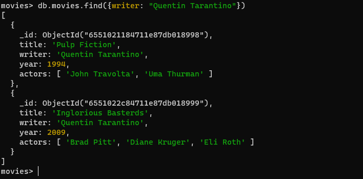

//Consultas / Buscar documentos Realizar las siguientes consultas en la colección movies: //
1. Obtener todos los documentos 
db.movies.find()

2. Obtener documentos con writer igual a "Quentin Tarantino" 
db.movies.find({writer: "Quentin Tarantino" })

3. Obtener documentos con actors que incluyan a "Brad Pitt" 
db.movies.find({actors: "Brad Pitt"})

4. Obtener documentos con franchise igual a "The Hobbit" 
 db.movies.find({franchise: "The Hobbit"})

5. Obtener todas las películas de los 90s. 
db.movies.find({year: { $lt: 2000}})

6. Obtener las películas estrenadas entre el año 2000 y 2010.
db.movies.find({year: { $lt: 2010, $gt: 2000 } })

---------------------------------------------------------------------------------------------------------------------------------------------------------------------------------

//Actualizar Documentos //
1. Agregar sinopsis a "The Hobbit: An Unexpected Journey" : "A reluctant hobbit, Bilbo Baggins, sets out to the Lonely Mountain with a spirited group of dwarves to reclaim their mountain home - and the gold within it - from the dragon Smaug." 
 db.movies.updateOne({title: "The Hobbit: An Unexpected Journey"}, { $set: {synopsis: "A reluctant hobbit, Bilbo Baggins, sets out to the Lonely Mountain with a spirited group of dwarves to reclaim their mountain home - and the gold within it - from the dragon Smaug."}})

2. Agregar sinopsis a "The Hobbit: The Desolation of Smaug" : "The dwarves, along with Bilbo Baggins and Gandalf the Grey, continue their quest to reclaim Erebor, their homeland, from Smaug. Bilbo Baggins is in possession of a mysterious and magical ring." 
 db.movies.updateOne({title: "The Hobbit: The Desolation of Smaug"}, { $set: {synopsis: "The dwarves, along with Bilbo Baggins and Gandalf the Grey, continue their quest to reclaim Erebor, their homeland, from Smaug. Bilbo Baggins is in possession of a mysterious and magical ring." }})

3. Agregar una actor llamado "Samuel L. Jackson" a la película "Pulp Fiction" 
db.movies.updateOne({title: "Pulp Fiction"}, { $set: {actors: "Samuel L. Jackson"}})

------------------------------------------------------------------------------------------------------------------------------------------------------------------------------------

//Búsqueda por Texto / Text Search// 
1. Encontrar las películas que en el título contengan la palabra "Hobbit" 
db.movies.find({title: {$regex: "Hobbit"}})

2. Encontrar las películas que en la sinopsis contengan la palabra "Gandalf" 
db.movies.find({synopsis: {$regex: "Gandalf"}})

3. Encontrar las películas que en la sinopsis contengan la palabra "Bilbo" y no la palabra "Gandalf" 
movies> db.movies.find({$and: [{synopsis: {$regex: "Bilbo",}},{synopsis: {$not: {$regex: "Gandalf"}}}]})

4. Encontrar las películas que en la sinopsis contengan la palabra "dwarves" ó "hobbit" 
db.movies.find({$or: [{synopsis: {$regex: "dwarves"}},{synopsis: {$regex:"hobbit"}}]})

5. Encontrar las películas que en la sinopsis contengan la palabra "gold" y "dragon"
db.movies.find({$or: [{synopsis: {$regex: "gold"}},{synopsis: {$regex:"dragon"}}]})

-----------------------------------------------------------------------------------------------------------------------------------------------------------------------------------

//Eliminar Documentos// 
1. Eliminar la película "Pee Wee Herman's Big Adventure" 
db.movies.deleteOne({title: "Pee Wee Herman's Big Adventure" })

2. Eliminar la película "Avatar" 
db.movies.deleteOne({title: "Avatar" })

------------------------------------------------------------------------------------------------------------------------------------------------------------------------------------

//consulta final elementos//

